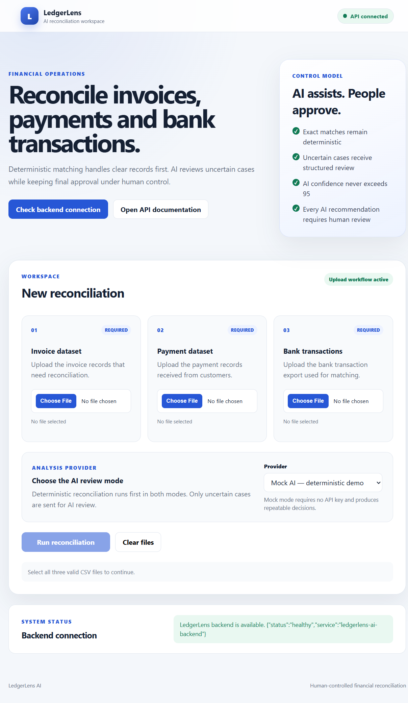
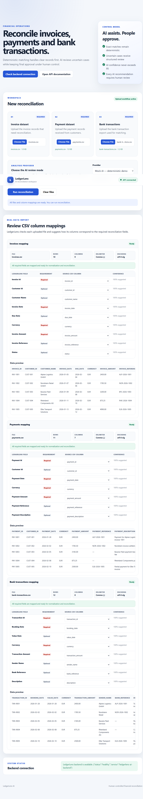
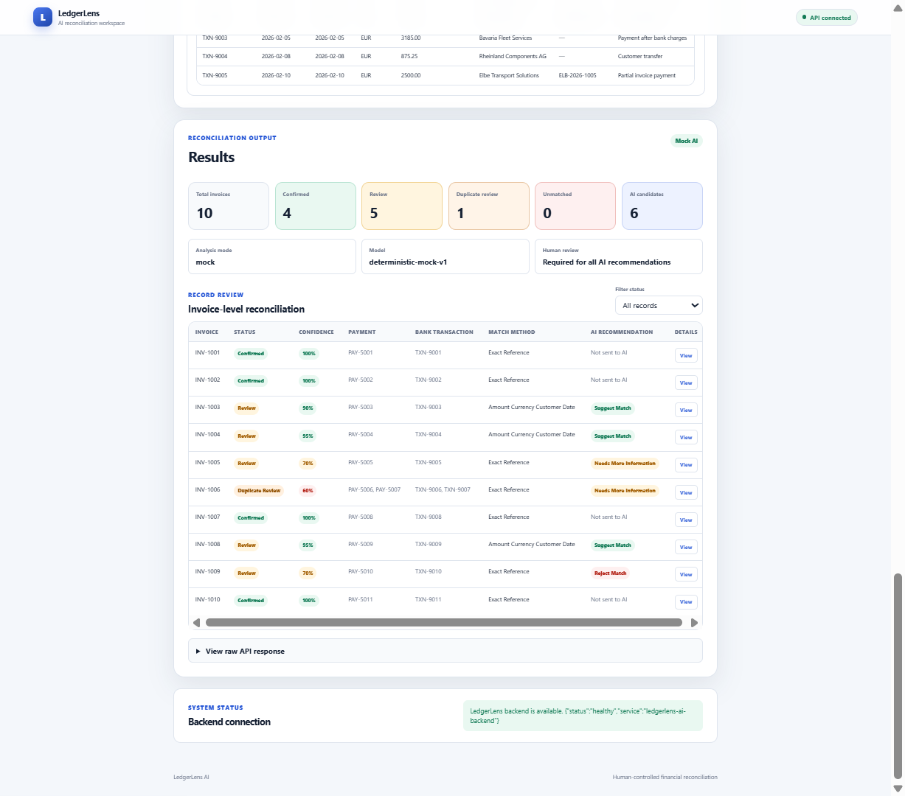
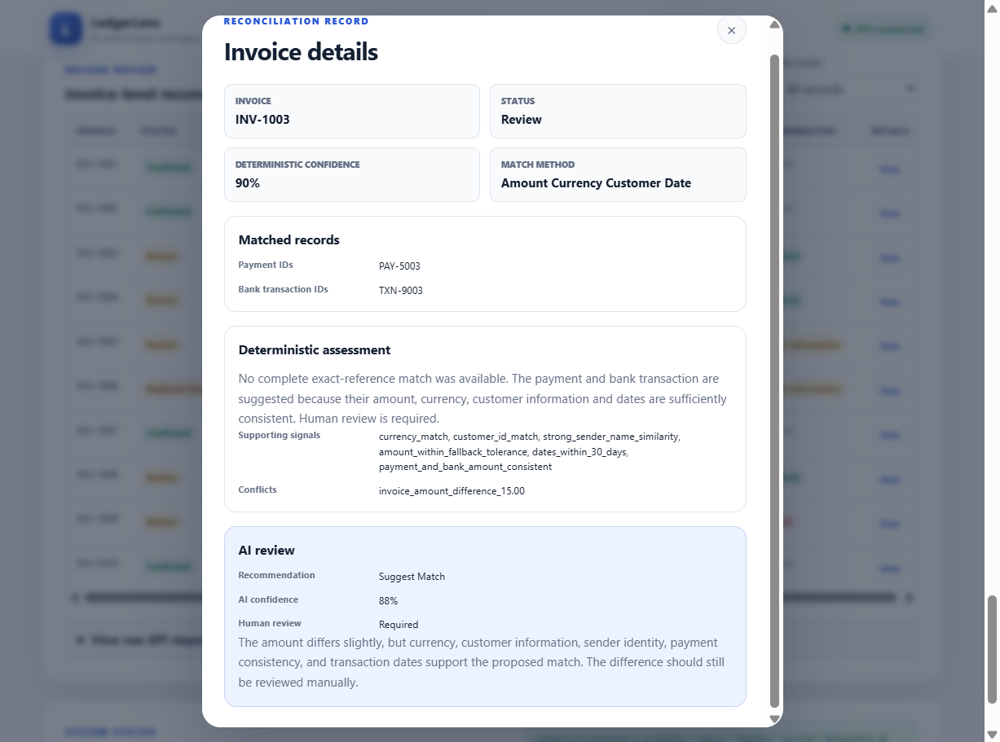
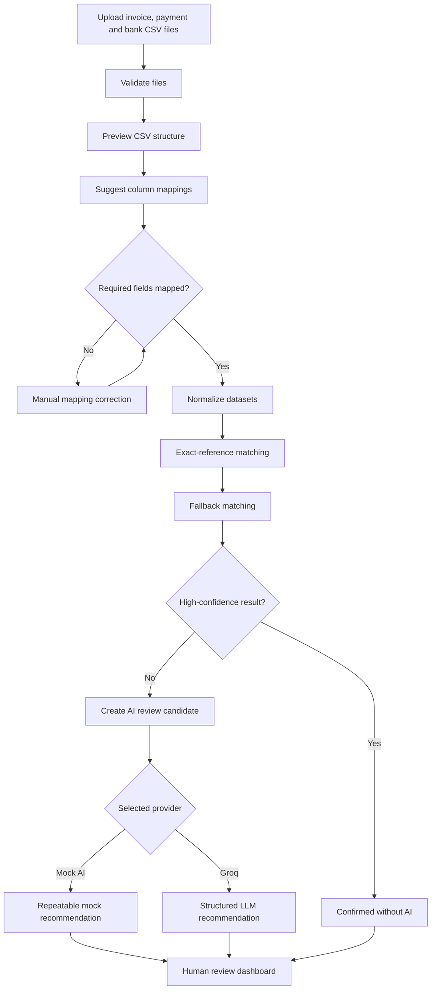
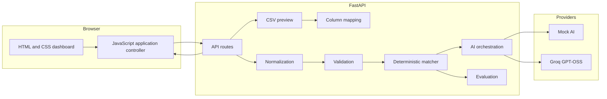

[](https://github.com/abuzarabbas/ledgerlens-ai/actions/workflows/backend-tests.yml)

[Live Demo](https://ledgerlens-ai.onrender.com) · [API Documentation](https://ledgerlens-ai.onrender.com/docs) · [Source Code](https://github.com/abuzarabbas/ledgerlens-ai)

> The public Render service may take several seconds to wake after inactivity.

---

## Overview

LedgerLens AI is a portfolio MVP for reconciling invoices, customer payments, and bank transactions.

The system uses a hybrid workflow:

1. Deterministic rules handle clear, high-confidence matches.
2. Ambiguous records are routed to Mock AI or a live Groq-hosted LLM.
3. Every AI recommendation remains subject to human review.

The project demonstrates practical AI product design, financial workflow modelling, structured LLM outputs, explainability, automated testing, and cloud deployment.

---

## Product Screenshots

### Upload workspace

Users upload invoice, payment, and bank-transaction datasets and select the AI review mode.



### CSV mapping and preview

LedgerLens detects CSV structure, suggests field mappings, allows manual correction, and previews source data before reconciliation.



### Reconciliation results

The results dashboard separates confirmed records, review cases, duplicate-review cases, unmatched records, and AI candidates.



### Human-in-the-loop AI review

Each uncertain record includes deterministic evidence, conflicts, an AI recommendation, confidence score, explanation, and mandatory human review.



---

## Problem

Financial reconciliation becomes difficult when:

- References are incomplete or inconsistent.
- Bank descriptions contain unstructured text.
- Different systems use different column names.
- Several records share the same amount.
- Customer and sender names vary.
- One invoice has multiple plausible matches.
- Manual investigation creates operational delays.

Sending every record to an LLM would be expensive, harder to audit, and unnecessary for clear cases.

LedgerLens therefore applies deterministic controls first and uses AI only for ambiguity.

---

## Key Capabilities

### Flexible CSV import

- Invoice, payment, and bank-transaction uploads
- Delimiter and encoding detection
- Source-data preview
- Automatic column suggestions
- Manual mapping correction
- Normalization into a common internal schema
- Required-field and file validation

### Deterministic reconciliation

The matching engine evaluates signals such as:

- Invoice, payment, and bank references
- Amount and currency consistency
- Customer identity
- Sender-name similarity
- Invoice, payment, and booking dates
- Exact-reference and fallback matching rules

### AI-assisted review

LedgerLens supports:

- **Mock AI** for stable, repeatable demonstrations
- **Live Groq analysis** using `openai/gpt-oss-20b`

AI recommendations are returned as structured outcomes:

- `suggest_match`
- `reject_match`
- `needs_more_information`

### Human-in-the-loop safeguards

- Deterministically confirmed records bypass AI.
- AI cannot finalize a financial match.
- Every AI recommendation requires human review.
- Supporting signals and conflicts remain visible.
- Provider and quota failures are surfaced to the user.
- AI confidence is capped by the application policy.

---

## System Workflow



---

## Architecture



---

## Demo Outcome

The included synthetic demonstration contains ten invoices:

| Result | Count |
|---|---:|
| Confirmed | 4 |
| Review | 5 |
| Duplicate review | 1 |
| Unmatched | 0 |
| AI review candidates | 6 |

Confirmed records are not sent to AI. Only uncertain cases receive an AI-assisted recommendation.

---

## Technology Stack

**Backend:** Python, FastAPI, Pandas, Uvicorn  
**Frontend:** HTML, CSS, Vanilla JavaScript, Fetch API  
**AI:** Groq API, GPT-OSS, structured outputs, Mock AI  
**Quality:** Pytest, FastAPI TestClient, GitHub Actions, Swagger/OpenAPI  
**Deployment:** Render

---

## Repository Structure

```text
ledgerlens-ai/
├── .github/workflows/
├── backend/
│   ├── ai_service.py
│   ├── evaluator.py
│   ├── groq_analyzer.py
│   ├── import_mapper.py
│   ├── import_normalize.py
│   ├── import_preview.py
│   ├── main.py
│   ├── matcher.py
│   └── validators.py
├── data/synthetic/
├── docs/screenshots/
├── frontend/
├── tests/
├── .env.example
├── .gitignore
├── LICENSE
└── README.md
```

---

## Run Locally

### 1. Clone the repository

```bash
git clone https://github.com/abuzarabbas/ledgerlens-ai.git
cd ledgerlens-ai
```

### 2. Create and activate a virtual environment

Windows PowerShell:

```powershell
python -m venv .venv
.\.venv\Scripts\Activate.ps1
```

macOS or Linux:

```bash
python -m venv .venv
source .venv/bin/activate
```

### 3. Install dependencies

```bash
pip install -r backend/requirements.txt
```

### 4. Configure live Groq analysis

Copy `.env.example` to `.env` and add:

```env
GROQ_API_KEY=your_private_api_key
GROQ_MODEL=openai/gpt-oss-20b
```

Mock AI works without an API key.

### 5. Start the application

```bash
python -m uvicorn backend.main:app --reload
```

Open:

- Dashboard: `http://127.0.0.1:8000`
- Swagger: `http://127.0.0.1:8000/docs`
- Health check: `http://127.0.0.1:8000/health`

---

## Demo Files

Use the files under:

```text
data/synthetic/
```

Main demonstration files:

```text
invoices.csv
payments.csv
bank-transactions.csv
```

Use `real-style-invoices.csv` to demonstrate flexible column mapping.

---

## Testing

Run the automated test suite:

```bash
python -m pytest -v
```

GitHub Actions runs the backend tests automatically after repository updates.

The test suite covers:

- CSV validation
- Preview generation
- Column mapping
- Normalization
- Exact and fallback matching
- Evaluation
- Mock AI behaviour
- Groq response handling
- API endpoints
- Invalid-input and provider-error scenarios

---

## Responsible AI Design

### Deterministic first

Clear financial matches are handled through explicit rules rather than an LLM.

### AI for ambiguity

Only uncertain reconciliation cases are sent for AI-assisted review.

### Structured output

The model must return a controlled recommendation rather than unrestricted prose.

### Human accountability

AI assists the reviewer but does not own the final financial decision.

---

## Current Limitations

LedgerLens is a portfolio MVP, not a production accounting platform.

Current limitations include:

- CSV input only
- No authentication or user accounts
- No persistent database
- No saved reconciliation history
- No reviewer assignment or approval audit trail
- No accounting-system write-back
- No ERP integrations
- No advanced partial-payment or many-to-many settlement engine
- No foreign-exchange reconciliation
- No statistically calibrated confidence model
- Live AI depends on external provider availability and quota
- No production-grade security or compliance certification

The public demo should only be used with synthetic or non-confidential information.

---

## Future Improvements

Potential next steps include:

- Excel and bank-statement import
- PDF invoice extraction
- European date and number formats
- Partial-payment allocation
- Many-to-many reconciliation
- Persistent reconciliation jobs
- Authentication and reviewer roles
- Audit logs and approval tracking
- ERP and accounting integrations
- Data redaction before external AI calls
- Confidence calibration using labelled data
- Prompt and model-version tracking

---

## What This Project Demonstrates

- AI product architecture
- Human-in-the-loop workflow design
- Deterministic and probabilistic system boundaries
- Structured LLM outputs
- Prompt and schema design
- Explainable AI recommendations
- Financial workflow modelling
- Data normalization
- REST API design
- Automated testing and CI
- Cloud deployment
- Responsible AI constraints

---

## Disclaimer

LedgerLens AI is an educational and portfolio project. It is not an accounting system, audit tool, financial advisory service, or certified reconciliation platform. All outputs require independent human verification.
